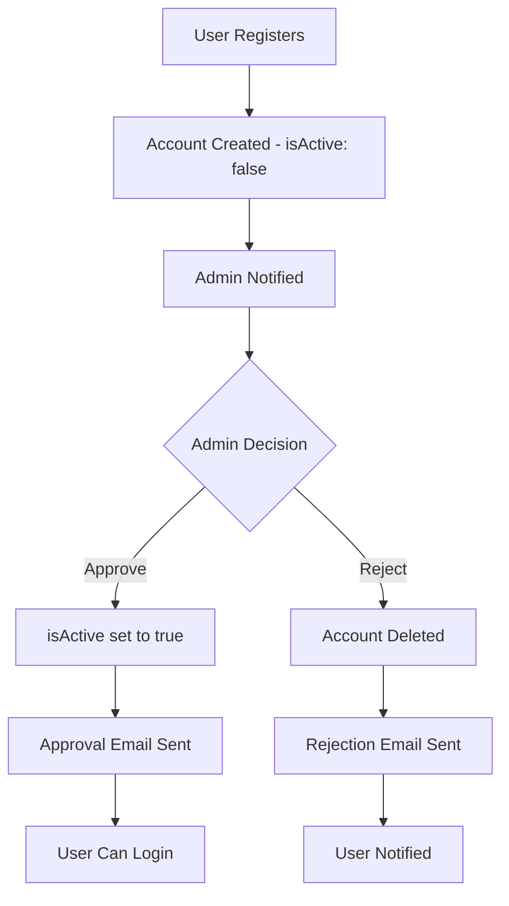

# 📧 User Approval & Email Notification System

## Overview
Implemented a complete admin approval workflow with automatic email notifications for user registrations. When admins approve or reject user accounts, the system sends professional HTML emails to notify users.

---

## ✨ Features

### 1. **Admin Approval Workflow**
- Admins can view all pending user registrations
- Approve users with one click
- Reject users with a reason
- Real-time status updates

### 2. **Email Notifications**
- **Approval Email**: Professional HTML email sent when user is approved
- **Rejection Email**: Notification with reason when registration is rejected
- **Development Mode**: Emails logged to console (no SMTP needed for dev)
- **Production Mode**: Real SMTP integration for live emails

### 3. **Security**
- Only MoSJE-Admin role can approve/reject users
- Email sending doesn't block the approval process
- Secure token-based authentication for admin actions

---

## 🎯 How It Works

### User Registration Flow



### Step-by-Step Process

1. **User Signs Up** (`/signup`)
   - Fills registration form
   - Selects role (MoSJE-Admin, State-Admin, or Agency-User)
   - Provides role-specific info (agency/state)
   - Submits form

2. **Account Created** (Backend)
   - User saved to database with `isActive: false`
   - Cannot login until approved
   - Success message shown

3. **Admin Reviews** (`/pending-users`)
   - Admin logs in and navigates to "Pending Users"
   - Sees list of all pending registrations
   - Reviews user details (name, email, role, agency/state)

4. **Admin Approves**
   - Clicks "✅ Approve" button
   - Backend:
     - Sets `isActive: true`
     - Sends HTML approval email
     - Returns success

5. **User Receives Email**
   - Professional HTML email with:
     - Account approval confirmation
     - Login credentials reminder
     - Direct link to login page
     - Account details summary

6. **User Can Login**
   - User visits login page
   - Enters credentials
   - Successfully logs in

---

## 📁 Files Created/Modified

### Backend

#### **New Files**

1. **`server/utils/emailService.js`** ✨ NEW
   - Email sending utility using Nodemailer
   - Functions:
     - `sendApprovalEmail(user)` - Sends approval notification
     - `sendRejectionEmail(user, reason)` - Sends rejection notification
   - HTML email templates
   - Development mode (console logging)
   - Production mode (SMTP)

#### **Modified Files**

2. **`server/controllers/userController.js`**
   - Added: `approveUser()` function
   - Added: `rejectUser()` function
   - Modified: `updateUser()` - Now sends email when `isActive` changes
   - Imported: `sendApprovalEmail`, `sendRejectionEmail`

3. **`server/routes/userRoutes.js`**
   - Added route: `PUT /api/users/:id/approve` (Admin only)
   - Added route: `DELETE /api/users/:id/reject` (Admin only)

4. **`server/.env.example`**
   - Added SMTP configuration variables
   - Email service settings

### Frontend

#### **New Files**

5. **`client/src/pages/PendingUsersPage.jsx`** ✨ NEW
   - Admin-only page to view pending users
   - Approve/Reject functionality
   - Real-time list updates
   - Rejection reason modal
   - Beautiful UI with cards and badges

#### **Modified Files**

6. **`client/src/App.js`**
   - Added route: `/pending-users` (MoSJE-Admin only)
   - Imported: `PendingUsersPage`

7. **`client/src/components/Sidebar.jsx`**
   - Added "Pending Users" navigation item
   - Shows only for MoSJE-Admin role
   - Icon: FiUserCheck (⏳)

---

## 🔌 API Endpoints

### Public Endpoints
| Method | Endpoint | Description |
|--------|----------|-------------|
| POST | `/api/users/register-public` | Register new user (pending approval) |

### Admin Endpoints
| Method | Endpoint | Description | Auth Required |
|--------|----------|-------------|---------------|
| GET | `/api/users?isActive=false` | Get all pending users | MoSJE-Admin |
| PUT | `/api/users/:id/approve` | Approve user & send email | MoSJE-Admin |
| DELETE | `/api/users/:id/reject` | Reject user & send email | MoSJE-Admin |
| PUT | `/api/users/:id` | Update user (also triggers email if approved) | MoSJE-Admin |

---

## ⚙️ Configuration

### Environment Variables

Add these to `server/.env`:

```bash
# Email Configuration (Optional - for user approval notifications)
# For development: Leave blank to log emails to console
# For production: Configure SMTP settings

# Gmail Example:
SMTP_HOST=smtp.gmail.com
SMTP_PORT=587
SMTP_SECURE=false
SMTP_USER=your_email@gmail.com
SMTP_PASS=your_app_password
SMTP_FROM="JanConnect <noreply@janconnect.gov.in>"

# SendGrid Example:
# SMTP_HOST=smtp.sendgrid.net
# SMTP_PORT=587
# SMTP_USER=apikey
# SMTP_PASS=your_sendgrid_api_key

# Other SMTP services work too!
```

### Development Mode (Default)

When SMTP is not configured, emails are logged to the backend console:

```
📧 ========== EMAIL NOTIFICATION ==========
To: user@example.com
Subject: 🎉 Your JanConnect Account Has Been Approved
-------------------------------------------
Dear John Doe,

Great news! Your JanConnect account has been approved...
===========================================
```

### Production Mode

Configure SMTP settings in `.env` to send real emails.

---

## 📧 Email Templates

### Approval Email

**Subject**: 🎉 Your JanConnect Account Has Been Approved

**Features**:
- Professional HTML design
- Gradient header with checkmark icon
- Account details summary
- Direct login button
- Responsive layout
- Dark/light email client support

**Content Includes**:
- User name
- Email address
- Role assignment
- Agency (for Agency-User)
- State (for State-Admin)
- Login URL button
- Support information

### Rejection Email

**Subject**: JanConnect Account Registration Update

**Features**:
- Professional HTML design
- Red gradient header
- Rejection reason (if provided)
- Support contact information

**Content Includes**:
- User name
- Rejection notification
- Optional reason from admin
- Contact information for appeals

---

## 🎨 Frontend UI

### Pending Users Page (`/pending-users`)

**Features**:
- **Header**: Title, description, refresh button
- **Stats Card**: Shows pending approvals count
- **User Cards**: Each pending user displayed in a card with:
  - Avatar (first letter of name)
  - Name and email
  - Role badge (color-coded)
  - State (if State-Admin)
  - Agency (if Agency-User)
  - Registration date
  - Approve/Reject buttons

**Actions**:
- **Approve**: Single click approval with confirmation
- **Reject**: Opens modal to enter rejection reason

**UI States**:
- Loading spinner while fetching
- Empty state when no pending users
- Processing state during approve/reject
- Error messages if API fails

**Color Coding**:
- MoSJE-Admin: Purple badge
- State-Admin: Blue badge
- Agency-User: Green badge

---

## 🧪 Testing

### Test the Complete Flow

#### 1. Register a New User

```bash
# Using PowerShell
$body = @{
  name = "Test User"
  email = "testuser@example.com"
  password = "test123"
  role = "Agency-User"
  agency = "AGENCY_ID_HERE"
} | ConvertTo-Json

Invoke-RestMethod -Uri "http://localhost:5000/api/users/register-public" `
  -Method POST `
  -Body $body `
  -ContentType "application/json"
```

**Expected Result**:
- User created with `isActive: false`
- Cannot login yet
- Shows in pending users list

#### 2. Admin Views Pending Users

1. Login as admin: `admin@example.com` / `password123`
2. Click "Pending Users" in sidebar
3. Should see the new user in the list

#### 3. Admin Approves User

1. Click "✅ Approve" button
2. Confirm in dialog
3. Check backend console for email log (dev mode)
4. User disappears from pending list

#### 4. User Receives Email (Dev Mode)

Check backend terminal output:

```
📧 ========== EMAIL NOTIFICATION ==========
To: testuser@example.com
Subject: 🎉 Your JanConnect Account Has Been Approved
...
```

#### 5. User Can Now Login

1. Go to `/login`
2. Enter: `testuser@example.com` / `test123`
3. Should successfully login
4. Redirected to dashboard

### Test Rejection Flow

1. Register another user
2. Admin clicks "❌ Reject"
3. Enter reason: "Invalid agency information"
4. Confirm rejection
5. Check backend console for rejection email log
6. User removed from database
7. Cannot login anymore

---

## 🚀 Usage Examples

### For Admins

#### View Pending Users

```javascript
// Navigate to
http://localhost:3000/pending-users

// Or use Sidebar
Click "Pending Users" → See list of all pending registrations
```

#### Approve User via API

```bash
# PowerShell
$token = "YOUR_ADMIN_TOKEN"
Invoke-RestMethod -Uri "http://localhost:5000/api/users/USER_ID/approve" `
  -Method PUT `
  -Headers @{ Authorization = "Bearer $token" }
```

#### Reject User via API

```bash
# PowerShell
$token = "YOUR_ADMIN_TOKEN"
$body = @{ reason = "Invalid credentials" } | ConvertTo-Json

Invoke-RestMethod -Uri "http://localhost:5000/api/users/USER_ID/reject" `
  -Method DELETE `
  -Body $body `
  -Headers @{ Authorization = "Bearer $token" } `
  -ContentType "application/json"
```

---

## 🔐 Security Features

1. **Role-Based Access**:
   - Only MoSJE-Admin can approve/reject users
   - Routes protected with `adminOnly` middleware

2. **Email Safety**:
   - Email sending failure doesn't block approval
   - Errors logged but not shown to users
   - Email validation on user model

3. **Data Protection**:
   - Passwords hashed before storage
   - JWT tokens for authentication
   - User data populated with agency details

4. **Audit Trail**:
   - Console logs for all email sends
   - User activation tracked via `isActive` field
   - Registration timestamps preserved

---

## 📊 Database Changes

### User Model
No schema changes required! Uses existing fields:
- `isActive`: Boolean (default: true, set to false for public registrations)
- `createdAt`: Timestamp (for registration date)
- All other fields remain unchanged

---

## 🎯 Future Enhancements

1. **Email Templates**:
   - [ ] Customizable email templates via admin panel
   - [ ] Multiple language support
   - [ ] Branding customization

2. **Notifications**:
   - [ ] In-app notifications for admins
   - [ ] SMS notifications
   - [ ] Push notifications

3. **Batch Operations**:
   - [ ] Approve multiple users at once
   - [ ] Bulk rejection with same reason

4. **Analytics**:
   - [ ] Approval rate tracking
   - [ ] Average approval time
   - [ ] Registration trends

5. **Auto-Approval**:
   - [ ] Auto-approve based on email domain
   - [ ] Auto-approve for certain agencies
   - [ ] Approval rules engine

---

## 🐛 Troubleshooting

### Issue: Emails not sending in production

**Solution**:
1. Check SMTP credentials in `.env`
2. Enable "Less secure app access" for Gmail
3. Use App Passwords for Gmail (2FA enabled)
4. Check firewall/port blocking (587, 465)
5. Verify SMTP_HOST and SMTP_PORT are correct

### Issue: Admin can't see Pending Users page

**Solution**:
1. Check user role is `MoSJE-Admin`
2. Verify JWT token is valid
3. Check console for permission errors
4. Ensure route is protected correctly

### Issue: Approval works but no email

**Solution**:
1. Check backend console for email logs (dev mode)
2. Verify SMTP settings (production)
3. Check email service logs
4. Test with simple email client

### Issue: User still can't login after approval

**Solution**:
1. Verify `isActive` is true in database
2. Check backend logs for approval success
3. Clear browser cache and try again
4. Verify email matches login credentials

---

## 📚 Related Documentation

- [SIGNUP-FEATURE.md](./SIGNUP-FEATURE.md) - User registration
- [AGENCIES-SETUP.md](./AGENCIES-SETUP.md) - Agency management
- [SIGNUP-TROUBLESHOOTING.md](./SIGNUP-TROUBLESHOOTING.md) - Common issues

---

**Status**: ✅ Fully Implemented  
**Last Updated**: October 12, 2025  
**Version**: 1.0.0

