# JanConnect Project Approach - Single Slide Flowchart

## Project Approach Overview

**Problem Statement:** Mapping of Implementing and Executing Agencies across PM-AJAY Components

This flowchart illustrates the systematic approach taken to develop JanConnect, a comprehensive web portal for the Ministry of Social Justice & Empowerment to efficiently map, manage, and monitor implementing and executing agencies across all PM-AJAY scheme components.

```mermaid
graph TB
    Start([Problem Statement:<br/>Mapping of Implementing & Executing<br/>Agencies across PM-AJAY Components]) --> Analysis[Phase 1: Requirements Analysis<br/>• Agency role identification<br/>• Component-wise mapping study<br/>• Stakeholder workflow analysis]
    
    Analysis --> Design[Phase 2: System Design<br/>• Agency-Component mapping architecture<br/>• MERN stack selection<br/>• Database schema for agencies<br/>• Role-based access control design]
    
    Design --> Backend[Phase 3: Backend Development<br/>• Agency & Project REST APIs<br/>• JWT authentication system<br/>• Agency-Project relationship mapping<br/>• MongoDB integration]
    
    Backend --> Frontend[Phase 4: Frontend Development<br/>• Agency selection interfaces<br/>• Component-wise project views<br/>• Redux state management<br/>• Responsive dashboard design]
    
    Frontend --> Integration[Phase 5: Integration & Features<br/>• Implementing-Executing agency linking<br/>• Component-based project tracking<br/>• Financial monitoring per agency<br/>• Real-time milestone updates]
    
    Integration --> Testing[Phase 6: Testing & QA<br/>• Agency mapping validation<br/>• Component-wise data integrity<br/>• User role access testing<br/>• Performance optimization]
    
    Testing --> Deployment[Phase 7: Deployment Ready<br/>• Production environment setup<br/>• Agency data seeding<br/>• Documentation complete<br/>• GitHub repository published]
    
    Deployment --> Outcome([Outcome:<br/>Comprehensive Agency Mapping System<br/>Across All PM-AJAY Components<br/>with Real-Time Monitoring])
    
    style Start fill:#ffebee,stroke:#c62828,stroke-width:3px
    style Analysis fill:#e3f2fd,stroke:#1565c0,stroke-width:2px
    style Design fill:#f3e5f5,stroke:#6a1b9a,stroke-width:2px
    style Backend fill:#fff3e0,stroke:#e65100,stroke-width:2px
    style Frontend fill:#e0f2f1,stroke:#00695c,stroke-width:2px
    style Integration fill:#fce4ec,stroke:#ad1457,stroke-width:2px
    style Testing fill:#f1f8e9,stroke:#558b2f,stroke-width:2px
    style Deployment fill:#e8eaf6,stroke:#283593,stroke-width:2px
    style Outcome fill:#e8f5e9,stroke:#2e7d32,stroke-width:3px
```

---

## Key Approach Highlights

### 🎯 **Problem-Centric Design**
- **Core Challenge**: Mapping implementing and executing agencies across PM-AJAY components (Adarsh Gram, GIA, Hostel)
- **Solution Focus**: Centralized digital platform for agency-component relationship management
- Designed for multi-level stakeholder collaboration
- Enhanced transparency and accountability in agency operations

### 🏛️ **PM-AJAY Component Coverage**
1. **Adarsh Gram**: Model village development projects
2. **GIA (Grant-in-Aid)**: Financial assistance programs
3. **Hostel**: Infrastructure development for SC/ST students

Each component mapped with:
- **Implementing Agency**: State/Central government bodies
- **Executing Agency**: Ground-level implementation partners

### 🏗️ **Modern Technology Stack**
- **Frontend**: React.js with Redux Toolkit
- **Backend**: Node.js + Express.js
- **Database**: MongoDB with Mongoose ODM
- **Cloud**: Cloudinary for file management

### 🔐 **Security-First Architecture**
- JWT-based authentication
- Role-based access control (RBAC)
- Encrypted password storage with bcrypt
- Protected API endpoints

### 👥 **User-Centric Roles**
1. **MoSJE-Admin**: National-level oversight of all agencies and components
2. **State-Admin**: State-specific agency and project management
3. **Agency-User**: Project execution, milestone updates, and reporting

### 📊 **Core Functionalities**
- **Agency-Project Mapping**: Link implementing and executing agencies to projects
- **Component-Wise Tracking**: Monitor projects across Adarsh Gram, GIA, and Hostel
- **State-Based Filtering**: View agency operations by geographic region
- **Milestone Management**: Track agency performance with evidence uploads
- **Financial Dashboard**: Monitor budget allocation and utilization per agency
- **Real-Time Analytics**: Visual charts for agency-wise project distribution

### 🎨 **Modern UI/UX**
- Glassmorphism design
- Dark mode support
- Responsive across devices
- Intuitive navigation

---

## Implementation Methodology

---

## Success Metrics

| Metric | Target | Achievement |
|--------|--------|-------------|
| **Agency Mapping** | All implementing & executing agencies | ✅ Implemented |
| **PM-AJAY Components** | 3 components (Adarsh Gram, GIA, Hostel) | ✅ Complete |
| **User Roles** | 3 distinct hierarchical levels | ✅ Implemented |
| **Agency-Project Linking** | Dynamic assignment system | ✅ Functional |
| **State Coverage** | All Indian states & districts | ✅ Complete |
| **Real-Time Updates** | Milestone tracking with evidence | ✅ Cloudinary |
| **Authentication** | Secure JWT with role-based access | ✅ Implemented |
| **Database Design** | Normalized agency-project relationships | ✅ MongoDB |
| **Documentation** | Comprehensive flowcharts & guides | ✅ Complete |

---

*This approach ensures efficient mapping and monitoring of implementing and executing agencies across all PM-AJAY components, enabling transparent governance and accountability in the Ministry of Social Justice & Empowerment's development initiatives.*
