# JanConnect Architecture & Flow Documentation

This document provides comprehensive visual documentation of the JanConnect MERN application architecture and key user flows using Mermaid.js flowcharts.

---

## 1. User Authentication & Role-Based Access Flow

This flowchart illustrates the complete authentication process from user login through JWT verification and role-based dashboard routing.

```mermaid
graph TD
    Start([User Opens Application]) --> LoginPage[User Navigates to Login Page]
    LoginPage --> EnterCreds[User Enters Email & Password]
    EnterCreds --> SubmitForm[Submit Login Form]
    
    SubmitForm --> FrontendValidation{Frontend Validation<br/>Email & Password Present?}
    FrontendValidation -->|No| ShowError[Display Validation Error]
    ShowError --> EnterCreds
    FrontendValidation -->|Yes| SendRequest[Redux: dispatch loginUser action]
    
    SendRequest --> BackendReceive[Backend: POST /api/users/login]
    BackendReceive --> UserController[userController.loginUser]
    
    UserController --> ValidateInput{Validate Input<br/>Email & Password?}
    ValidateInput -->|No| Return400[Return 400 Error:<br/>'Provide email & password']
    
    ValidateInput -->|Yes| QueryDB[Query MongoDB:<br/>User.findOne email]
    QueryDB --> UserExists{User Found?}
    UserExists -->|No| Return401A[Return 401 Error:<br/>'Invalid email or password']
    
    UserExists -->|Yes| PopulateAgency[Populate Agency Data<br/>.select '+password'<br/>.populate 'agency']
    PopulateAgency --> ComparePassword[user.matchPassword:<br/>bcrypt.compare password]
    
    ComparePassword --> PasswordMatch{Password<br/>Matches?}
    PasswordMatch -->|No| Return401B[Return 401 Error:<br/>'Invalid email or password']
    
    PasswordMatch -->|Yes| CheckActive{user.isActive?}
    CheckActive -->|No| Return401C[Return 401 Error:<br/>'User account is inactive']
    
    CheckActive -->|Yes| GenerateJWT[Generate JWT Token:<br/>jwt.sign with user._id<br/>expires in 30 days]
    GenerateJWT --> ReturnUserData[Return User Data:<br/>_id, name, email, role,<br/>agency, state, token]
    
    ReturnUserData --> FrontendReceive[Frontend: Receive Response]
    FrontendReceive --> StoreRedux[Redux: Store user data<br/>in auth.user state]
    StoreRedux --> StoreLocal[localStorage: Save token<br/>for persistence]
    
    StoreLocal --> CheckRole{Check User Role}
    CheckRole -->|MoSJE-Admin| AdminDashboard[Navigate to:<br/>National Dashboard<br/>Full Access to All States]
    CheckRole -->|State-Admin| StateAdminDashboard[Navigate to:<br/>State Dashboard<br/>Access to Assigned State Only]
    CheckRole -->|Agency-User| AgencyDashboard[Navigate to:<br/>Agency Dashboard<br/>Access to Assigned Projects Only]
    
    AdminDashboard --> DashboardRender[Render Dashboard with Stats]
    StateAdminDashboard --> DashboardRender
    AgencyDashboard --> DashboardRender
    
    DashboardRender --> ProtectedRoute[Subsequent Requests:<br/>Include JWT in Header<br/>'Bearer token']
    
    ProtectedRoute --> Middleware[authMiddleware.protect<br/>Validates Every Request]
    Middleware --> ExtractToken[Extract Token from<br/>Authorization Header]
    ExtractToken --> VerifyJWT[jwt.verify token,<br/>JWT_SECRET]
    
    VerifyJWT --> TokenValid{Token Valid?}
    TokenValid -->|No| Return401D[Return 401:<br/>'Token failed']
    TokenValid -->|Yes| FindUser[Query User by decoded.id<br/>.populate 'agency']
    
    FindUser --> UserFound{User Exists<br/>& Active?}
    UserFound -->|No| Return401E[Return 401:<br/>'User not found or inactive']
    UserFound -->|Yes| AttachUser[Attach user to req.user]
    
    AttachUser --> CheckPermission{Route Requires<br/>Admin/StateAdmin?}
    CheckPermission -->|adminOnly| VerifyAdmin{user.role ==<br/>'MoSJE-Admin'?}
    VerifyAdmin -->|No| Return403A[Return 403:<br/>'Not authorized as admin']
    VerifyAdmin -->|Yes| AllowAccess[Allow Access]
    
    CheckPermission -->|stateAdminOnly| VerifyStateAdmin{user.role ==<br/>'State-Admin' OR<br/>'MoSJE-Admin'?}
    VerifyStateAdmin -->|No| Return403B[Return 403:<br/>'Not authorized']
    VerifyStateAdmin -->|Yes| AllowAccess
    
    CheckPermission -->|No Special Role| AllowAccess
    AllowAccess --> ProcessRequest[Process Request & Return Data]
    
    ProcessRequest --> End([User Authenticated & Authorized])
    
    Return400 --> ErrorResponse[Display Error Message]
    Return401A --> ErrorResponse
    Return401B --> ErrorResponse
    Return401C --> ErrorResponse
    Return401D --> ErrorResponse
    Return401E --> ErrorResponse
    Return403A --> ErrorResponse
    Return403B --> ErrorResponse
    ErrorResponse --> EnterCreds

    style Start fill:#e1f5e1
    style End fill:#e1f5e1
    style GenerateJWT fill:#fff4e6
    style StoreRedux fill:#e3f2fd
    style AdminDashboard fill:#f3e5f5
    style StateAdminDashboard fill:#f3e5f5
    style AgencyDashboard fill:#f3e5f5
    style ErrorResponse fill:#ffebee
```

---

## 2. Core Workflow: Milestone Update by Agency User

This flowchart details the end-to-end process of an Agency User updating a project milestone with file evidence upload.

```mermaid
graph LR
    Start([Agency User Opens<br/>Project Detail Page]) --> LoadProject[Component Mounts:<br/>useEffect calls<br/>dispatch getProjectById]
    
    LoadProject --> ReduxAction1[Redux Action:<br/>getProjectById id]
    ReduxAction1 --> APICall1[API: GET /api/projects/:id<br/>with Bearer Token]
    APICall1 --> AuthMiddleware1[authMiddleware.protect<br/>Verifies JWT & User]
    
    AuthMiddleware1 --> Controller1[projectController<br/>.getProjectById]
    Controller1 --> DBQuery1[MongoDB Query:<br/>Project.findById id<br/>.populate agencies]
    DBQuery1 --> CheckAccess1{Check User Access:<br/>State matches OR<br/>Agency matches?}
    
    CheckAccess1 -->|No Access| Return403[Return 403:<br/>'Not authorized']
    CheckAccess1 -->|Has Access| ReturnProject[Return Project Data<br/>with Milestones Array]
    
    ReturnProject --> RenderUI[Frontend: Render UI<br/>SingleProjectPage displays<br/>Project Details & Milestones]
    
    RenderUI --> UserView[User Views Milestone<br/>with Status: Pending]
    UserView --> ClickUpload[User Clicks<br/>'Upload Evidence' Button]
    
    ClickUpload --> OpenModal[FileUploadModal Opens<br/>State: isOpen = true]
    OpenModal --> SelectFile[User Selects File<br/>from File System]
    
    SelectFile --> FileValidation{File Validation:<br/>Size < 10MB?<br/>Allowed Format?}
    FileValidation -->|Invalid| ShowAlert[Alert: 'File size too large'<br/>or 'Invalid format']
    ShowAlert --> SelectFile
    
    FileValidation -->|Valid| StoreFile[Store File in State:<br/>setFile selectedFile]
    StoreFile --> ClickUploadBtn[User Clicks<br/>'Upload' Button]
    
    ClickUploadBtn --> SetLoading[Set uploading = true<br/>Show Loading Spinner]
    SetLoading --> DispatchUpload[dispatch uploadFile<br/>projectId, file]
    
    DispatchUpload --> CreateFormData[Create FormData:<br/>formData.append 'file', file]
    CreateFormData --> APICall2[API: POST<br/>/api/projects/:id/upload<br/>Content-Type: multipart/form-data<br/>Bearer Token]
    
    APICall2 --> AuthMiddleware2[authMiddleware.protect<br/>Verifies JWT]
    AuthMiddleware2 --> MulterMiddleware[Multer Middleware:<br/>upload.single 'file'<br/>Processes multipart data]
    
    MulterMiddleware --> CloudinaryStorage[CloudinaryStorage:<br/>Uploads to Cloudinary<br/>folder: janconnect/milestones]
    CloudinaryStorage --> CloudinaryUpload[Cloudinary Service:<br/>Stores file in cloud<br/>Returns URL & public_id]
    
    CloudinaryUpload --> RouteHandler[Route Handler:<br/>Validates req.file exists]
    RouteHandler --> ReturnURL[Return JSON:<br/>url: file.path<br/>filename: file.filename]
    
    ReturnURL --> ReceiveURL[Frontend: Receive<br/>Cloudinary URL]
    ReceiveURL --> ShowSuccess[Show Success Message:<br/>'File uploaded successfully!'<br/>Green checkmark icon]
    
    ShowSuccess --> CallOnSuccess[Call onSuccess url<br/>callback function]
    CallOnSuccess --> SetEvidenceURL[Set evidenceUrl<br/>in milestone data]
    
    SetEvidenceURL --> AutoCloseModal[Auto-close Modal<br/>after 2 seconds]
    AutoCloseModal --> UserUpdateStatus[User Updates<br/>Milestone Status to<br/>'Completed' in dropdown]
    
    UserUpdateStatus --> ClickSave[User Clicks<br/>'Save' Button]
    ClickSave --> DispatchUpdate[dispatch updateMilestone<br/>projectId, milestoneId,<br/>status, evidenceUrl]
    
    DispatchUpdate --> APICall3[API: PUT<br/>/api/projects/:id/milestone/:mid<br/>Body: status, evidenceUrl<br/>Bearer Token]
    
    APICall3 --> AuthMiddleware3[authMiddleware.protect<br/>Verifies JWT]
    AuthMiddleware3 --> Controller2[projectController<br/>.updateMilestone]
    
    Controller2 --> DBQuery2[MongoDB Query:<br/>Project.findById id]
    DBQuery2 --> ProjectFound{Project Exists?}
    ProjectFound -->|No| Return404[Return 404:<br/>'Project not found']
    
    ProjectFound -->|Yes| CheckAccess2{Verify User Access:<br/>State matches OR<br/>Agency in implementing<br/>OR executing?}
    CheckAccess2 -->|No Access| Return403B[Return 403:<br/>'Not authorized']
    
    CheckAccess2 -->|Has Access| FindMilestone[Find Milestone:<br/>project.milestones<br/>.id milestoneId]
    
    FindMilestone --> MilestoneFound{Milestone Exists?}
    MilestoneFound -->|No| Return404B[Return 404:<br/>'Milestone not found']
    
    MilestoneFound -->|Yes| UpdateFields[Update Milestone:<br/>milestone.status = status<br/>milestone.evidenceUrl = url<br/>milestone.completedDate = now]
    
    UpdateFields --> SetUpdatedBy[Set project.lastUpdatedBy<br/>= req.user._id]
    SetUpdatedBy --> SaveToDB[project.save<br/>Persist to MongoDB]
    
    SaveToDB --> ReturnUpdated[Return Updated<br/>Project Document]
    ReturnUpdated --> UpdateRedux[Redux: Update<br/>project state with<br/>new milestone data]
    
    UpdateRedux --> ReRender[Re-render UI:<br/>Milestone shows<br/>Status: Completed<br/>Evidence: Link with icon<br/>Updated Date]
    
    ReRender --> ShowNotification[Show Success Notification:<br/>'Milestone updated successfully']
    ShowNotification --> End([Milestone Update Complete])
    
    Return403 --> ErrorUI[Display Error in UI]
    Return404 --> ErrorUI
    Return403B --> ErrorUI
    Return404B --> ErrorUI
    ErrorUI --> UserView

    style Start fill:#e1f5e1
    style End fill:#e1f5e1
    style FileUploadModal fill:#e3f2fd
    style MulterMiddleware fill:#fff4e6
    style CloudinaryStorage fill:#fff4e6
    style CloudinaryUpload fill:#fff4e6
    style UpdateRedux fill:#f3e5f5
    style ReRender fill:#f3e5f5
    style ErrorUI fill:#ffebee
```

---

## 3. High-Level MERN Stack Data Flow

This flowchart illustrates the high-level request-response cycle for fetching all projects, showing the complete MERN stack architecture.

```mermaid
graph TD
    Start([User on Dashboard]) --> UIAction[User Interface:<br/>DashboardPage Component]
    
    UIAction --> UseEffect[useEffect Hook:<br/>Component Mount]
    UseEffect --> DispatchAction[dispatch getProjects]
    
    DispatchAction --> ReduxLayer[Redux Layer:<br/>projectSlice.js<br/>createAsyncThunk]
    
    ReduxLayer --> PrepareRequest[Prepare API Request:<br/>- Get token from auth state<br/>- Build Authorization header<br/>- Apply query filters if any]
    
    PrepareRequest --> AxiosCall[Axios HTTP Client:<br/>axios.get '/api/projects'<br/>Headers: Bearer token]
    
    AxiosCall --> Network[Network Layer:<br/>HTTP GET Request<br/>to Express Server]
    
    Network --> ExpressServer[Express.js Server:<br/>server.js listening<br/>on PORT 5000]
    
    ExpressServer --> RouteMatcher[Express Router:<br/>Match Route Pattern<br/>GET /api/projects]
    
    RouteMatcher --> ProjectRoute[projectRoutes.js:<br/>router.route '/']
    
    ProjectRoute --> AuthMiddleware[authMiddleware.protect:<br/>1. Extract JWT from header<br/>2. Verify token signature<br/>3. Decode user ID<br/>4. Query User model<br/>5. Attach user to req.user]
    
    AuthMiddleware --> TokenValid{JWT Valid &<br/>User Active?}
    TokenValid -->|No| Unauthorized[Return 401:<br/>'Not authorized'<br/>JSON response]
    
    TokenValid -->|Yes| ControllerCall[projectController<br/>.getProjects req, res]
    
    ControllerCall --> BuildQuery[Build MongoDB Query:<br/>Based on User Role]
    
    BuildQuery --> RoleCheck{Check req.user.role}
    RoleCheck -->|MoSJE-Admin| QueryAll[Query: No filter<br/>Access all projects<br/>across all states]
    RoleCheck -->|State-Admin| QueryState[Query: state = req.user.state<br/>Filter by user's state]
    RoleCheck -->|Agency-User| QueryAgency[Query: $or<br/>implementingAgency = user.agency<br/>executingAgency = user.agency]
    
    QueryAll --> ApplyFilters[Apply Additional Filters:<br/>status, component, search<br/>from req.query params]
    QueryState --> ApplyFilters
    QueryAgency --> ApplyFilters
    
    ApplyFilters --> MongooseQuery[Mongoose ORM:<br/>Project.find query<br/>.populate implementingAgency<br/>.populate executingAgency<br/>.sort -createdAt]
    
    MongooseQuery --> MongoDBDriver[MongoDB Native Driver:<br/>Translates to MongoDB<br/>query language]
    
    MongoDBDriver --> DatabaseQuery[MongoDB Database:<br/>Execute query on<br/>projects collection<br/>with indexes]
    
    DatabaseQuery --> FetchData[Retrieve Matching<br/>Documents from Database]
    
    FetchData --> ReturnToMongoose[Return Results to<br/>Mongoose as Documents]
    
    ReturnToMongoose --> TransformData[Mongoose:<br/>Transform to JavaScript objects<br/>Apply virtuals & methods<br/>Populate referenced docs]
    
    TransformData --> ControllerResponse[Controller:<br/>Prepare JSON Response<br/>res.json projects]
    
    ControllerResponse --> ExpressResponse[Express:<br/>Set Response Headers<br/>Content-Type: application/json<br/>Status: 200 OK]
    
    ExpressResponse --> NetworkResponse[Network:<br/>HTTP Response sent<br/>to Client]
    
    NetworkResponse --> AxiosReceive[Axios:<br/>Receive Response<br/>response.data]
    
    AxiosReceive --> ReduxFulfilled[Redux:<br/>Action Fulfilled<br/>Update State:<br/>projects = response.data<br/>isLoading = false]
    
    ReduxFulfilled --> ReactRerender[React:<br/>State Change Detected<br/>useSelector hook triggers]
    
    ReactRerender --> UpdateUI[Update UI:<br/>- Render ProjectTable<br/>- Display project list<br/>- Show statistics<br/>- Update charts]
    
    UpdateUI --> DisplayData[User Sees:<br/>- Project cards<br/>- Status badges<br/>- Financial data<br/>- Interactive elements]
    
    DisplayData --> End([Data Displayed Successfully])
    
    Unauthorized --> ErrorHandler[Redux:<br/>Action Rejected<br/>isError = true<br/>message = error]
    
    ErrorHandler --> ShowError[UI: Display Error:<br/>Alert or Toast<br/>Redirect to Login if 401]
    ShowError --> LoginRedirect([Redirect to Login])

    style Start fill:#e1f5e1
    style End fill:#e1f5e1
    style ReduxLayer fill:#e3f2fd
    style ExpressServer fill:#fff4e6
    style ProjectRoute fill:#fff4e6
    style AuthMiddleware fill:#fff4e6
    style ControllerCall fill:#fff4e6
    style DatabaseQuery fill:#f3e5f5
    style MongoDBDriver fill:#f3e5f5
    style ReduxFulfilled fill:#e3f2fd
    style UpdateUI fill:#e1f5e1
    style ErrorHandler fill:#ffebee
    style ShowError fill:#ffebee
```

---

## Architecture Notes

### Authentication & Authorization
- **JWT Tokens**: Generated with 30-day expiration, stored in localStorage and Redux state
- **Middleware Chain**: All protected routes pass through `protect` → role-specific middleware → controller
- **Role Hierarchy**: MoSJE-Admin (highest) → State-Admin → Agency-User (lowest)

### File Upload Flow
- **Multer**: Handles multipart/form-data parsing on the server
- **Cloudinary**: Cloud storage service for milestone evidence files
- **Validation**: 10MB size limit, restricted file formats (.jpg, .png, .pdf, .doc, .docx)

### Data Access Patterns
- **MoSJE-Admin**: Full database access, no filters applied
- **State-Admin**: Filtered by `state` field matching user's assigned state
- **Agency-User**: Filtered by `implementingAgency` OR `executingAgency` matching user's agency

### Redux State Management
- **Async Thunks**: Handle API calls with loading/error states
- **State Slices**: Separate slices for auth, projects, organized by feature
- **Middleware**: Redux Toolkit automatically handles serialization and thunks

### MongoDB Optimization
- **Population**: Related documents (agencies, users) are populated using Mongoose
- **Indexing**: Indexes on frequently queried fields (state, status, component)
- **Subdocuments**: Milestones stored as embedded array for atomic updates

---

*Generated for JanConnect - Ministry of Social Justice & Empowerment Project Management Portal*
